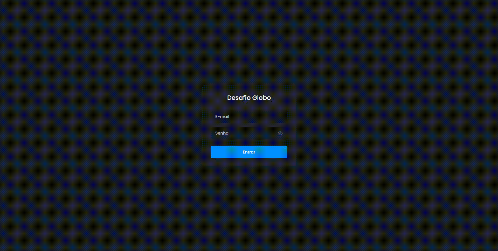
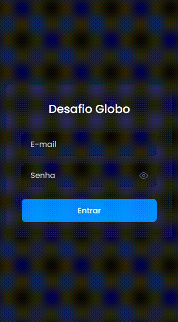
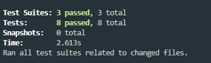

<!--
*** Obrigado por estar vendo o nosso README. Se você tiver alguma sugestão
*** que possa melhorá-lo ainda mais dê um fork no repositório e crie uma Pull
*** Request ou abra uma Issue com a tag "sugestão".
*** Obrigado novamente! Agora vamos rodar esse projeto incrível :D
-->

<!-- PROJECT SHIELDS -->

<!-- PROJECT LOGO -->
<br />
<p align="center">

  <h3 align="center">Desafio Globo</h3>
</p>

<!-- TABLE OF CONTENTS

## Tabela de Conteúdo

- [Tabela de Conteúdo](#tabela-de-conte%C3%BAdo)
- [Sobre o Projeto](#sobre-o-projeto)
  - [Feito Com](#feito-com)
- [Começando](#come%C3%A7ando)
  - [Pré-requisitos](#pr%C3%A9-requisitos)
  - [Estrutura de Arquivos](#estrutura-de-arquivos)
  - [Instalação](#instala%C3%A7%C3%A3o)
    - [Passo Adicional no Android](#passo-adicional-no-android)
  - [Edição](#edi%C3%A7%C3%A3o)
  - [Publicação](#publica%C3%A7%C3%A3o)
- [Contribuição](#contribui%C3%A7%C3%A3o)
- [Licença](#licen%C3%A7a)
- [Contato](#contato) -->

<!-- ABOUT THE PROJECT -->

## Sobre o Projeto

Este projeto Consiste em uma aplicação web em que seus usuários podem estar acessando tanto pelo browser de suas máquinas quanto por seus dispositivos móveis. Sendo assim a aplicação é responsiva.




### Feito Com

Abaixo segue o que foi utilizado na criação deste projeto:

- [ReactJs](https://pt-br.reactjs.org/) - O React é uma biblioteca JavaScript de código aberto com foco em criar interfaces de usuário em páginas web. É mantido pelo Facebook, Instagram, outras empresas e uma comunidade de desenvolvedores individuais;
- [Typescript](https://www.typescriptlang.org/) - TypeScript é um superconjunto de JavaScript desenvolvido pela Microsoft que adiciona tipagem e alguns outros recursos a linguagem;
- [Json-Server](https://www.npmjs.com/package/json-server) - Fake Api rest para simulação de backend;
- [Styled-Components](https://styled-components.com/) - Não utilizei nenhuma ui, fiz tudo com css puro;
- [Axios](https://github.com/axios/axios) - O Axios é um cliente HTTP baseado em Promises para Browser e NodeJS;
- [ESLint](https://eslint.org/) - O ESLint é uma ferramenta de lint plugável para JavaScript e JSX;
  - [eslint-config-airbnb](https://github.com/airbnb/javascript/tree/master/packages/eslint-config-airbnb) - Este pacote fornece o .eslintrc do Airbnb como uma configuração compartilhada extensível;
  - [eslint-plugin-import](https://github.com/benmosher/eslint-plugin-import) - Plugin do ESLint com regras para ajudar na validação de imports;
  - [eslint-plugin-jsx-a11y](https://github.com/evcohen/eslint-plugin-jsx-a11y) - Verificador estático AST das regras do a11y em elementos JSX;
  - [eslint-plugin-react](https://github.com/yannickcr/eslint-plugin-react) - Regras de linting do ESLint específicas do React;
  - [eslint-plugin-react-native](https://github.com/Intellicode/eslint-plugin-react-native) - Regras de linting do ESLint específicas do React Native;
  - [eslint-import-resolver-babel-plugin-root-import](https://github.com/olalonde/eslint-import-resolver-babel-root-import) - Um resolver da lib _babel-root-import_ para a lib _eslint-plugin-import_;
- [Prettier](https://prettier.io/) - O Prettier atualiza seu código automaticamente seguindo os padrões que você quiser toda vez salva o arquivo;
  - [eslint-plugin-prettier](https://github.com/prettier/eslint-plugin-prettier) - Roda o Prettier como uma regra do ESLint;
  - [eslint-config-prettier](https://github.com/prettier/eslint-config-prettier) - Desativa todas as regras que são desnecessárias ou que podem dar conflito com o Prettier;
- [EditorConfig](https://editorconfig.org/) - O EditorConfig é um formatador de arquivos e coleções em forma de Plugin para Editores de código/texto com o objetivo de manter um padrão de código consistente entre diferentes editores, IDE's ou ambientes;
- [@testing-library/react](https://testing-library.com/) - Lib para fazer testes unitários, fiz como exemplo testes em componentes, hooks e em página;



<!-- GETTING STARTED -->

### Instalação

1. Para instalar e utilizar esse projeto o processo é bem simples, basta clonar o projeto utilizando o comando:

```sh
git clone https://github.com/toguvr/desafio_globo.git
```

2. Depois do projeto clonado você pode entrar na pasta raiz do projeto e dar o comando `yarn` para instalar as dependências, após isto basta rodar `yarn start` para iniciar o front e `yarn server` para iniciar a api fake **utilizada apenas para ficar mais próximo da realidade**.

3. Caso não tenha o a lib **json-server** basta rodar o comando `npm install -g json-server`.

---

#### Fazendo o login

Deixei preparado dois usuários:

1. Usuário comum (funcionário):

- E-mail: **usuariocomum@teste.com.br**
- Senha: **123456**

2. Usuário admin (administrador):

- E-mail: **usuarioadm@teste.com.br**
- Senha: **123456**

### Criação de Usuário

1. Para criar um usuário você precisa ser um administrador e ir na aba usuário no menu lateral:

2. Na listagem de usuários basta clicar no botão "+ Usuário" para criá-lo. **Um slider lateral irá abrir com os dados para serem preenchidos**

### Edição de Usuário

1. Para editar um usuário você precisa ser um administrador e ir na aba usuário no menu lateral:

2. Na listagem de usuários basta clicar no "lápis" para editá-lo. **Não mostro a senha na edição por questão de segurança**

### Exclusão de Usuário

1. Para excluir um usuário você precisa ser um administrador e ir na aba usuário no menu lateral:

2. Na listagem de usuários basta clicar no "lixo" para excluí-lo, irá aparecer um dialog box pedindo a confirmação. **Ao confirmar o usuário será excluído de verdade**

### Rotas Privadas

1. Usuário sem estar logado: **Roteamento o força para o login**

2. Usuário logado, mas sem premissão administrador. **Roteamento o força para dashboard, caso digite rotas de administrador ou login, será redirecionado para dashboard**

3. Usuário logado e com premissão administrador. **Roteamento somente não o permite ir para o login sem deslogar**

<!-- CONTACT -->

## Contato

Augusto Telles - [Github](https://github.com/toguvr) - **augustotf93@gmail.com**
